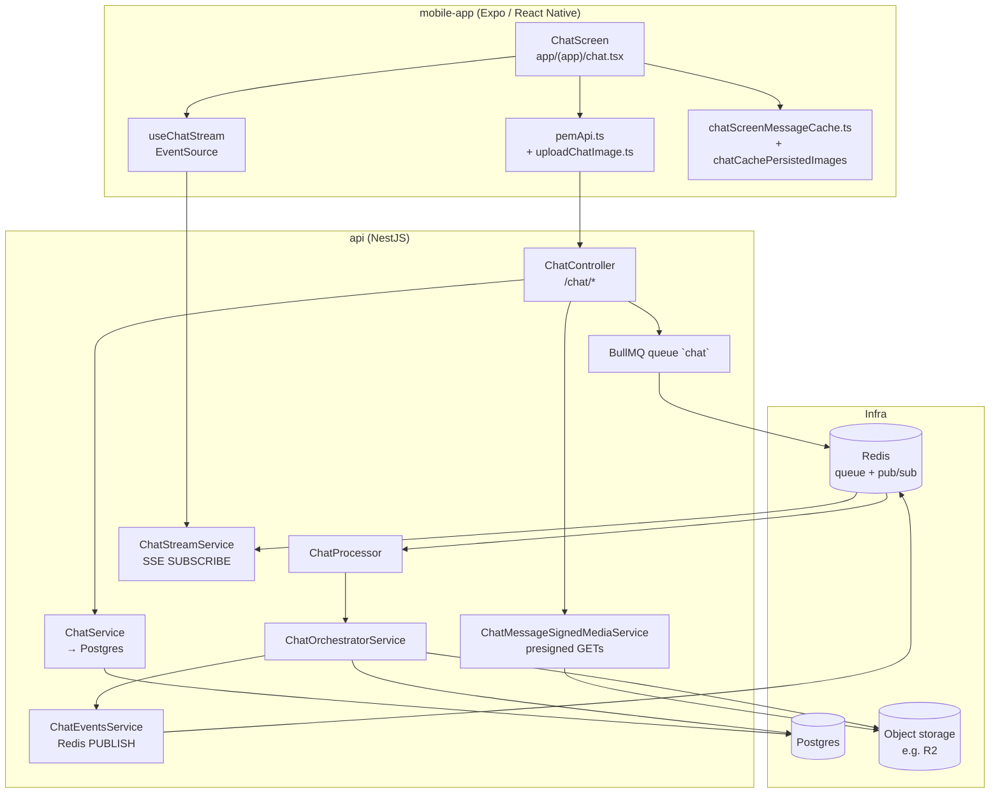
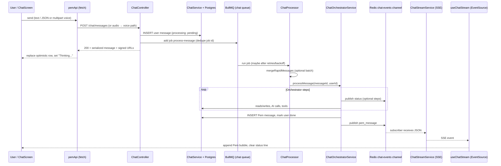
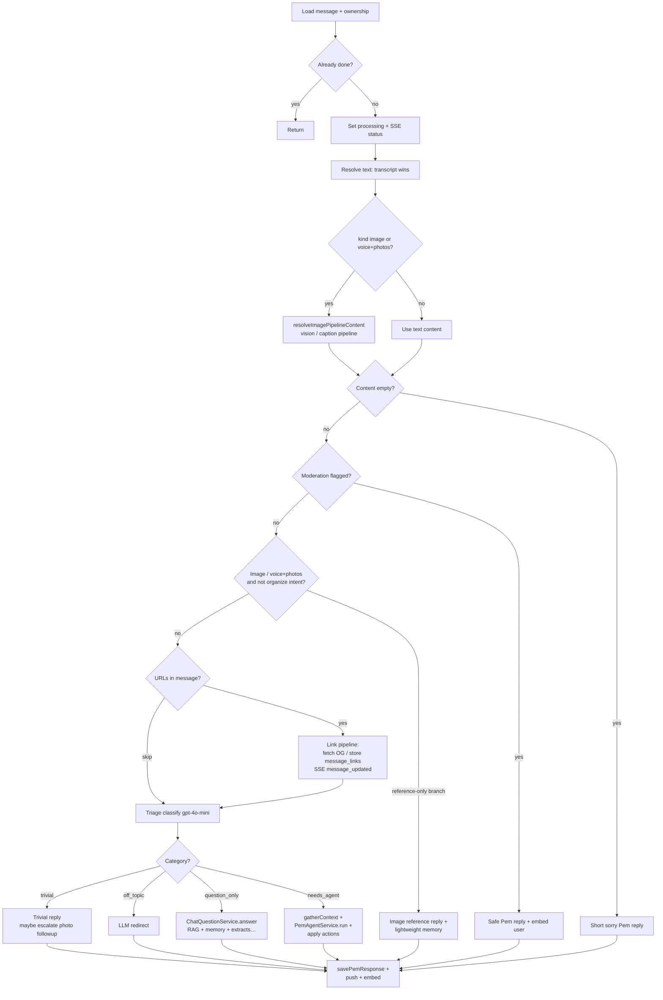

# Chat message pipeline

**What this document is:** A friendly, detailed map of how **one chat message** goes from your finger on the phone to **Pem’s reply** appearing in the thread — and how the app stays in sync while that happens.

**Who it’s for:** Someone new to the codebase (even if you’re young or new to coding). We use simple words first, then names of real files and folders so you can jump into the code.

**Repos this describes:**

- **`mobile-app/`** — Expo + React Native client.
- **`api/`** — NestJS HTTP API + background worker.

**Diagrams:** Mermaid blocks render in GitHub and many IDEs. If they don’t render, follow the numbered steps and tables — same story.

---

## Contents

1. [How it works (overview)](#how-it-works-overview)
2. [Tiny glossary](#tiny-glossary)
3. [Big picture: two lanes](#big-picture-two-lanes)
4. [Architecture diagram (boxes)](#architecture-diagram-boxes)
5. [Full send → reply sequence](#full-send--reply-sequence)
6. [Mobile app: what happens on the phone](#mobile-app-what-happens-on-the-phone)
7. [API: HTTP (fast) vs worker (slow thinking)](#api-http-fast-vs-worker-slow-thinking)
8. [Inside the worker: merge rapid sends](#inside-the-worker-merge-rapid-sends)
9. [Inside the orchestrator: step-by-step](#inside-the-orchestrator-step-by-step)
10. [SSE: live updates after you sent](#sse-live-updates-after-you-sent)
11. [When something goes wrong](#when-something-goes-wrong)
12. [Where data lives](#where-data-lives)
13. [Debugging cheat sheet](#debugging-cheat-sheet)
14. [File index](#file-index)

---

## How it works (overview)

1. **You tap send** — the app calls the API over **HTTP**. The server **saves** your message in Postgres, **enqueues** a background job, and returns **right away** with the real message id and any signed media URLs. It does **not** wait for AI or tools on that same request.
2. **Your message row** stays in the DB with `processing_status` set so the worker knows what to pick up.
3. A **BullMQ worker** runs **`ChatProcessor`** → **`ChatOrchestratorService.processMessage`**. That path can take seconds (transcription was already done for multipart voice; here we do triage, optional vision/links, models, writes to tasks/calendar/memory, etc.).
4. **When Pem’s reply is ready**, the server **publishes** events on a **Redis** channel scoped to your user. The **SSE** connection (`GET /chat/stream`) subscribed to that channel delivers **`pem_message`**, **`status`**, **`message_updated`**, and friends to the app so the UI updates without another manual refresh.

**Design rule:** **HTTP** = persist + acknowledge + enqueue. **Worker** = heavy pipeline. **SSE** = push incremental updates to the open chat screen.

---

## Tiny glossary

| Term | Meaning |
|------|----------------------|
| **HTTP request** | Phone asks server something once; server answers once (`fetch`). |
| **Optimistic UI** | Show your message *immediately* with a temp id; swap to the real id when the server answers. Feels instant. |
| **SSE (Server-Sent Events)** | The client opens a URL and **keeps the connection open**; the server **pushes** many events over time (server → client only). |
| **Redis** | Super-fast shared memory in the cloud. We use it for a **pub/sub channel per user** so every API instance can “broadcast” chat events to the right SSE connection. |
| **BullMQ / job queue** | A **to-do list for servers**: “Process message 42.” Workers pick jobs in the background. |
| **Drizzle / Postgres** | **Postgres** is the permanent notebook of all messages. **Drizzle** is the TypeScript-friendly way the API reads/writes that notebook. |
| **Presigned URL** | Server says: “Here is a one-time upload address; PUT the file there.” Object storage (e.g. R2) holds photos and voice blobs. |
| **Triage** | A small, fast model bucket: “Is this trivial? Off-topic web trivia? Only a lookup from *their* data? Or full Pem agent work?” |
| **Orchestrator** | The big function that runs **after** triage: vision, links, agent, saving Pem’s reply, embeddings, push. |

---

## Big picture: two lanes

```text
                    ┌─────────────────────────────────────────┐
                    │              YOUR PHONE                  │
                    │  Chat screen + input + optimistic bubble │
                    └───────────────┬─────────────────────────┘
                                    │
          Lane A (short)            │            Lane B (long-lived)
          HTTP: send / history      │            SSE: live events
                    │               │
                    ▼               ▼
┌───────────────────────────────────────────────────────────────────────┐
│                         API (NestJS)                                   │
│  ChatController  →  ChatService (DB)  →  BullMQ `chat` queue            │
│                              │                                         │
│                              │         Worker: ChatProcessor            │
│                              │              → ChatOrchestratorService   │
│                              │                         │                 │
│                              └──────── Redis publish ─┘                 │
│                                         (chat-events:{userId})          │
└───────────────────────────────────────────────────────────────────────┘
```

- **Lane A** — `POST /chat/messages`, `POST` with audio (multipart), `GET /chat/messages`, uploads, etc.
- **Lane B** — `GET /chat/stream` with `Authorization: Bearer …`; events like `pem_message`, `status`, `message_updated`.

---

## Architecture diagram (boxes)

Who talks to whom (typical production setup: Postgres, Redis, object storage).



---

## Full send → reply sequence

End-to-end timeline for the same steps as in [How it works (overview)](#how-it-works-overview):



---

## Mobile app: what happens on the phone

### Main screen: `mobile-app/app/(app)/chat.tsx`

Think of **three parallel concerns**:

1. **Paint something quickly** — On mount, read `AsyncStorage` (`@pem/chat_messages_v1`) via `readChatMessagesCache()` so the list isn’t empty. Then call `loadMessages()` to GET fresh rows from the server and **merge** with any local-only fields (`mergeServerMessagesWithClientLocals`). A successful **full** refresh (no `before` cursor) also **`writeChatMessagesCache`** — but only the **tail** of up to **50** “cacheable” messages (sent, no pending local upload fields). See `CHAT_MESSAGES_CACHE_LIMIT` in `chatScreenMessageCache.ts`.

2. **Stay live** — `useChatStream({ onPemMessage, onStatus, onMessageUpdated, onTasksUpdated })` opens SSE and dispatches events (below).

3. **Send** — `handleSendText`, `handleSendImage`, `handleComposerSend` (text vs pending photos), `handleSendVoice`. Pattern: **append optimistic row** → **await network** → **replace temp id with server id** → **set `statusMap[serverUserMessageId] = "Thinking..."`** until Pem finishes.

**`statusMap`** is just a dictionary: “For this **user** message id, show this subtitle under the bubble” (e.g. `Processing...`). When `pem_message` arrives, the code **deletes** the entry for `msg.parent_message_id` so the subtitle disappears.

### Optimistic text send (step by step)

1. Create `temp-text-${Date.now()}`, `_clientStatus: "sending"`, append to `messages`.
2. `sendChatMessage` → `POST /chat/messages` JSON `{ kind: "text", content }`.
3. Success: map temp row → `res.message`, `_clientStatus: "sent"`, set status map to `"Thinking..."`.
4. Failure: `_clientStatus: "failed"` (bubble shows error state).

### Images

1. **Upload first:** `uploadPendingChatImageKeys` loops each local URI — `sha256HexFromLocalUri`, `POST /chat/photos/upload-url` (server may return **`is_duplicate: true`** and skip a second PUT), then `FileSystem.uploadAsync` PUT to R2.
2. **Then send:** `sendChatMessage({ kind: "image", image_keys: [...], content? })`.
3. Optimistic row can carry `_localUri` / `_pendingLocalUris` so thumbnails work before URLs return.
4. After send, **optional** `pollChatMessageForLinkPreviews` (waits up to ~22s) to attach **`link_previews`** if the server filled them slightly later (SSE or GET may also update).

### Voice

1. `sendVoiceMessage` builds **`multipart/form-data`**: field `audio` (file), `kind: voice`, optional `image_keys` JSON string for composer photos.
2. Server transcribes, may upload audio to object storage, saves row with `content`/`transcript`, enqueues job — same mental model as text after that.

### SSE wiring: `useChatStream` → `openChatStreamConnection` → `dispatchChatSseEvent`

- **URL:** `{getApiBaseUrl()}/chat/stream` with `Authorization: Bearer <Clerk JWT>`.
- **Library:** `react-native-sse` `EventSource`.
- **Reconnect:** On error, disconnect and exponential backoff up to `CHAT_STREAM_MAX_RECONNECT_DELAY_MS` (`chatStream.constants.ts`).
- **Dispatch** (`dispatchChatSseEvent.ts`):

| Event type | Callback | Typical use |
|------------|----------|-------------|
| `pem_message` | `onPemMessage` | Append Pem row; dedupe by `msg.id`; clear status for parent user message. |
| `status` | `onStatus` | `(messageId, text)` — subtitle under **user** bubble. |
| `message_updated` | `onMessageUpdated` | Patch one field (e.g. `link_previews`) on an existing id. |
| `pem_token` | `onToken` | Streaming token chunk (if used). |
| `pem_stream_done` | `onStreamDone` | End streaming UI. |
| `tasks_updated` | `onTasksUpdated` | Refresh brief counts + task drawer. |

**Note:** The server can also publish **`processing_failed`** on the last retry of a failed job (`chat-orchestrator.service.ts`). The mobile `EventSource` **does not** register a listener for that type today, so the user still gets a **fallback Pem apology** via the normal `pem_message` path when the orchestrator calls `savePemResponse` on final failure.

### Display list: `buildChatDisplayItems`

The FlatList doesn’t always map 1:1 to `messages[]` — helpers merge in **date headers**, **status rows** from `statusMap`, etc. (`lib/buildChatDisplayItems.ts`).

---

## API: HTTP (fast) vs worker (slow thinking)

### Routes (truth table): `api/src/modules/chat/chat.controller.ts`

| Method / path | Role |
|---------------|------|
| `POST /chat/messages` | Main send. If body includes **file field `audio`**, delegated to **`ChatVoiceUploadService.acceptRecordedAudio`** (multipart). Else JSON validated as **`SendMessageDto`**. |
| Idempotency | Optional `idempotency_key` in body or, for multipart voice, query `?idempotency_key=`. If a row already exists for that user + key, return it with **`deduplicated: true`** (no duplicate job). |
| `kind: "image"` | Dedup/prepare image keys (`ChatImageDedupService`), `saveMessage` (`pending`), **register hashes**, enqueue **`process-message`**, return serialized row + signed media. |
| `kind: "text"` \| `"voice"` (JSON) | `saveMessage` with content / voice fields; optional voice **imageKeys** from payload; enqueue job. **Triage is not run here** — it runs in the orchestrator after content is fully known. |
| `POST /chat/photos/upload-url` | Presigned PUT for `chat-images/{userId}/{uuid}.ext`; duplicate SHA can short-circuit second upload. |
| `GET /chat/messages` | Paginated history; `ChatMessagesForClientService.serializeListWithMediaAndLinks` adds signed URLs + link preview shapes. |
| `GET /chat/stream` | `@Sse()` stream from `ChatStreamService.createStream(user.id)`; header `X-Accel-Buffering: no` for proxies. |
| `DELETE /chat/messages/:id` | User deletes their message row (see controller). |

### Voice upload detail: `api/src/modules/media/voice/chat-voice-upload.service.ts`

1. Parse idempotency + optional `image_keys` JSON from multipart.
2. **`TranscriptionService.transcribe`** on the audio buffer.
3. If storage enabled: upload to `chat-voice/{userId}/{timestamp}.m4a`, set `voiceUrl` / `audioKey`.
4. `saveMessage` with `kind: 'voice'`, `content` + `transcript`, optional `imageKeys`, `processingStatus: 'pending'`.
5. Enqueue **`process-message`** with **`buildChatProcessMessageJobOpts`** (see below).

### Job enqueue: `api/src/modules/chat/helpers/chat-inbound.helpers.ts`

- **`buildChatProcessMessageJobOpts(messageId)`** returns BullMQ options:
  - **`jobId`:** `` `${CHAT_JOB_ID_PREFIX}${messageId}` `` (`chat-msg-{uuid}`) so **re-enqueueing the same message replaces the job** — dedupe storms.
  - **`delay`:** `0` ms today (`CHAT_JOB_DELAY_MS_DUMP`).
  - **`attempts`:** `3` with exponential **`backoff`** starting at 2000 ms.

### Persistence: `api/src/modules/messages/chat.service.ts`

Responsible for **insert/update/delete** message rows, pagination (`before` + `limit`, clamped), idempotency lookup, serialization to DTO-shaped JSON, etc. **No AI here** — keep it thin and fast.

### Worker entry: `api/src/modules/messaging/jobs/chat.processor.ts`

- `@Processor('chat')` — queue name **`chat`**.
- **`mergeRapidMessages`** then **`ChatOrchestratorService.processMessage`**.
- Logs **messageId / userId / jobId**, not user text.

---

## Inside the worker: merge rapid sends

If you tap send **three times in eight seconds**, we don’t always want **three** full AI runs. **`mergeRapidMessages`** (`BATCH_WINDOW_MS` = **8000** from `chat.constants.ts`):

1. Find **other** user messages for same user with `processingStatus === 'pending'`, created within the window, excluding the **primary** `messageId`.
2. Concatenate their `transcript ?? content` onto the primary row’s **`content`** (joined by newlines).
3. Mark those peer rows `processingStatus: 'done'`.

When their own jobs run, the orchestrator **exits early** if the row is already **`done`** — so those jobs become cheap no-ops.

**Caveat:** merging is text-focused; rapid **image-first** messages have more edge cases — when debugging “wrong merge,” check timestamps and pending states.

---

## Inside the orchestrator: step-by-step

File: **`api/src/modules/messaging/chat-orchestrator.service.ts`** — method **`processMessage(messageId, userId, { isFinalAttempt })`**.

High-level flow (matches current code structure):



**Details worth knowing:**

- **`resolveImagePipelineContent`** — For image-heavy messages, turns pixels into text the rest of the pipeline can understand (vision path). Same for **voice + attached photos**.
- **Image “reference only”** — If the model thinks you’re **not** asking to “organize into inbox” and there are **no URLs** to read, Pem may answer in a **photo saver / memory** style without full task extraction (`ImageReferenceOnlyReplyService`).
- **Link pipeline** — **`ChatLinkPipelineService.processForMessage`**: SSRF-guarded fetch, OG tags, rows in **`message_links`**, prompt section for Ask/Agent, and **`message_updated`** so the client can show **`link_previews`** without waiting for a full reload.
- **Triage** — **`TriageService.classify`**: `gpt-4o-mini` + Zod structured output; categories **`trivial` | `question_only` | `off_topic` | `needs_agent`**. Special rule: phrases like **“I must …” / “I have to …”** force **`needs_agent`** even if raw triage said `question_only` (habits must create work).
- **`question_only`** — **`ChatQuestionService.answer`**: uses **only** the user’s own world (tasks, calendar, memory, RAG, link prompt section, etc.) — **not** open-web trivia.
- **`needs_agent`** — **`PemAgentService`**: extraction + orchestration passes (see `pem-backend.mdc` / agent module), **`applyAgentActions`** for creates/updates/calendar/memory, then **`savePemResponse`**.
- **`savePemResponse`** — Inserts Pem row (`parent_message_id` = user message), marks user row **`processing_status: 'done'`**, publishes **`pem_message`**, optional push (`PushService`), queues embedding for RAG later.

Constants you may tune: **`AGENT_RECENT_MESSAGES_LIMIT`**, **`RAG_*`**, **`BATCH_WINDOW_MS`**, photo recall caps — `api/src/modules/chat/constants/chat.constants.ts`.

---

## SSE: live updates after you sent

### Server side

1. **`ChatEventsService.publish(userId, event, data)`** → Redis **`PUBLISH`** on channel **`chat-events:{userId}`** with payload `{ event, data }` JSON-stringified.
2. **`ChatStreamService.createStream(userId)`** creates a **subscriber** Redis client, `SUBSCRIBE` to that channel, pushes each message into an RxJS stream merged with a **`heartbeat`** every **30s** (`HEARTBEAT_MS`).

If **`REDIS_URL`** is missing, SSE returns a single error-shaped event and completes — chat “live” mode won’t work.

### Client side

Already covered: `openChatStreamConnection` registers listeners for each event type; **`dispatchChatSseEvent`** JSON-parses `event.data` and calls the right callback.

---

## When something goes wrong

| Layer | What happens |
|-------|----------------|
| **HTTP send fails** | Optimistic row → `_clientStatus: "failed"`; user can retry manually. |
| **BullMQ job throws** | Retries up to **3** with backoff; logs warning with `messageId`. |
| **Final attempt still throws** | Orchestrator sets user message **`processing_status: 'failed'`**, **`savePemResponse`** with apology text, publishes **`processing_failed`** **and** the apology still arrives as a normal **`pem_message`**. User message may still be **embedded** for RAG if there was text (`queueUserMessageEmbedding`). |

---

## Where data lives

| Store | What |
|-------|------|
| **Postgres** | Canonical `messages` rows (user + Pem), extracts, embeddings metadata, `message_links`, etc. |
| **Object storage (R2)** | Photos under `chat-images/...`, voice under `chat-voice/...` — **keys** in DB, URLs signed at read time. |
| **Redis** | BullMQ **queue** + **`chat-events:{userId}`** pub/sub for SSE. |
| **AsyncStorage** | Mobile: last **50** cacheable messages JSON (`chatScreenMessageCache.ts`). |
| **Device disk** | Mobile: `documentDirectory/pem-chat-images/v1/` for hydrated thumbnails (`chatCachePersistedImages.ts`). |

---

## Debugging cheat sheet

| Symptom | Likely cause |
|--------|----------------|
| Bubble stuck on “sending” | Network / auth; `apiFetch` throws; Clerk token missing. |
| “Sent” but no Pem reply | Worker not running; `REDIS_URL` / queue misconfigured; job exception in logs. |
| Status stuck forever | SSE disconnected; or no `pem_message` / failed path. |
| Duplicate Pem lines | Race; client dedupes `onPemMessage` by `msg.id`. |
| Rapid sends merged “wrong” | `mergeRapidMessages` + 8s window; peers marked `done`. |
| Thumbnails missing offline | Cache slice / prune / hydrate path — `readChatMessagesCache` + `persistImagesForCacheMessages`. |
| Old history images only remote | By design: disk persist runs on **tail cache** after full `loadMessages()`, not when loading older pages with `before`. |

---

## File index

| Area | Path |
|------|------|
| Chat UI + optimistic sends + cache wiring | `mobile-app/app/(app)/chat.tsx` |
| HTTP client (chat) | `mobile-app/services/api/pemApi.ts` |
| API base URL resolution | `mobile-app/services/api/apiBaseUrl.ts` |
| Image upload + presign | `mobile-app/services/media/uploadChatImage.ts` |
| Message cache (AsyncStorage) | `mobile-app/services/cache/chatScreenMessageCache.ts` |
| Disk image hydrate / prune | `mobile-app/services/cache/chatCachePersistedImages.ts` |
| SSE hook | `mobile-app/hooks/chat/useChatStream.ts` |
| SSE connection | `mobile-app/hooks/chat/chatStream/openChatStreamConnection.ts` |
| SSE dispatch | `mobile-app/hooks/chat/chatStream/dispatchChatSseEvent.ts` |
| SSE types / callbacks | `mobile-app/hooks/chat/chatStream/chatStream.types.ts` |
| List rendering helper | `mobile-app/lib/buildChatDisplayItems.ts` |
| Client message shape | `mobile-app/lib/chatScreenClientMessage.types.ts` |
| Chat HTTP + SSE controller | `api/src/modules/chat/chat.controller.ts` |
| Send DTO / validation | `api/src/modules/chat/dto/send-message.dto.ts` |
| Inbound helpers (job opts, image payload) | `api/src/modules/chat/helpers/chat-inbound.helpers.ts` |
| Chat constants (RAG, batch window, job id) | `api/src/modules/chat/constants/chat.constants.ts` |
| DB access for messages | `api/src/modules/messages/chat.service.ts` |
| Client list serialization + links | `api/src/modules/messaging/chat-messages-for-client.service.ts` |
| Signed URLs for chat media | `api/src/modules/media/chat-message-signed-media.service.ts` |
| Voice multipart ingest | `api/src/modules/media/voice/chat-voice-upload.service.ts` |
| BullMQ processor | `api/src/modules/messaging/jobs/chat.processor.ts` |
| Orchestrator | `api/src/modules/messaging/chat-orchestrator.service.ts` |
| Triage LLM | `api/src/modules/messaging/triage.service.ts` |
| SSE stream | `api/src/modules/messaging/chat-stream.service.ts` |
| Redis publish | `api/src/modules/messaging/chat-events.service.ts` |
| Ask path | `api/src/modules/agent/question/chat-question.service.ts` |
| Pem agent | `api/src/modules/agent/pem-agent.service.ts`, `pem-agent-llm.service.ts` |
| Link fetch + pipeline | `api/src/modules/media/links/chat-link-pipeline.service.ts` |
| Photo vision / recall / reference-only | `api/src/modules/media/photo/*.service.ts` |
| Push when Pem replies | `api/src/modules/push/push.service.ts` (used from orchestrator) |
| Suppress noisy push when chat focused | `mobile-app/services/push/chatPushPresence.ts` |

---

## Related product docs

- `docs/photo-support-plan.md` (if present) — photo UX rollout notes.
- `.cursor/rules/pem-backend.mdc` — module layout, Drizzle, security, chat architecture summary.

---

## Maintenance

When routes, event names, job shape, or client optimistic rules change, **update this file in the same PR** so onboarding and debugging stay accurate.
