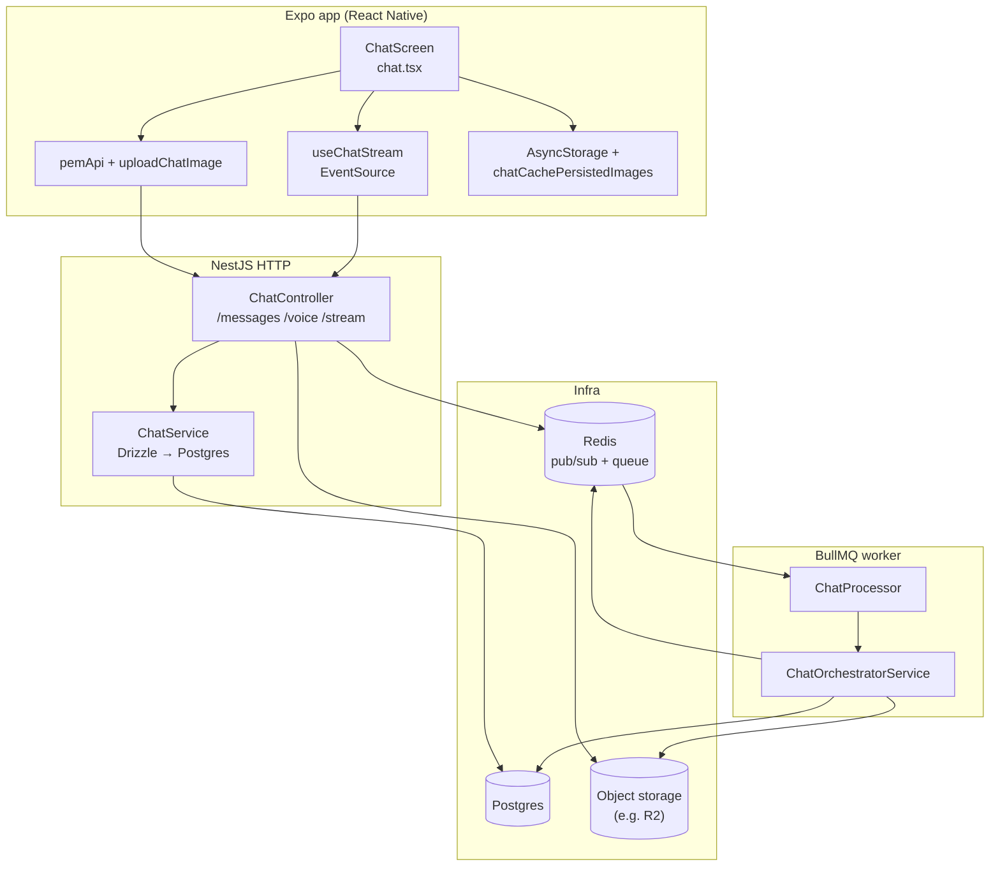
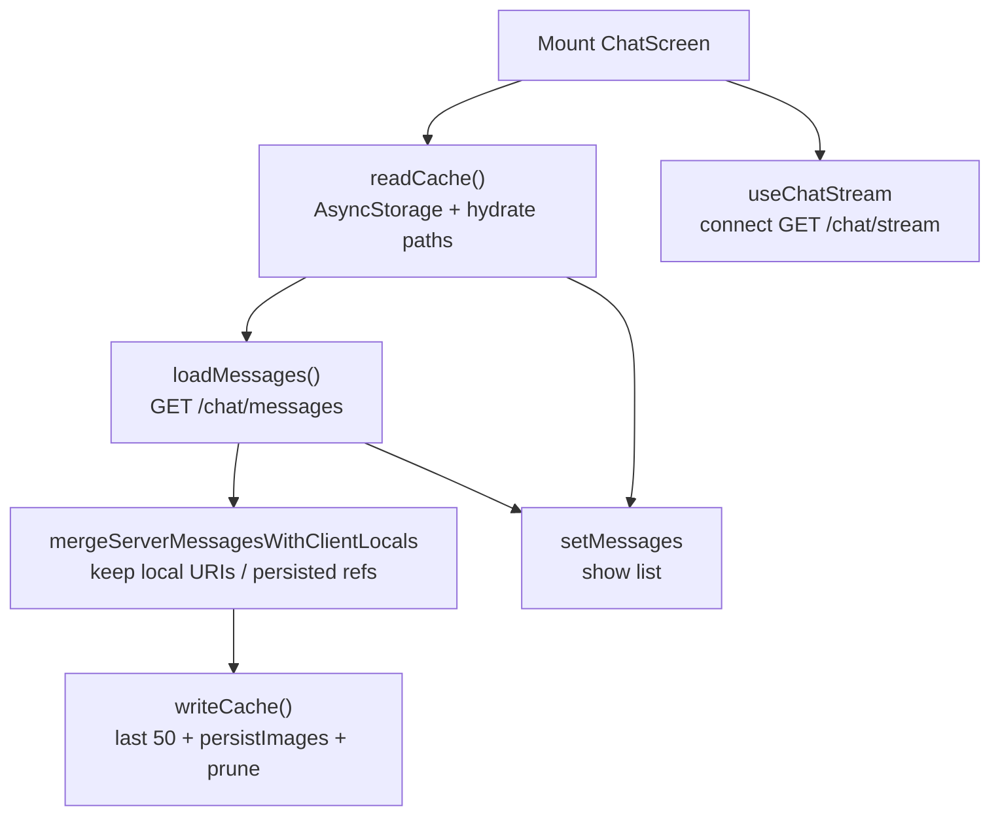
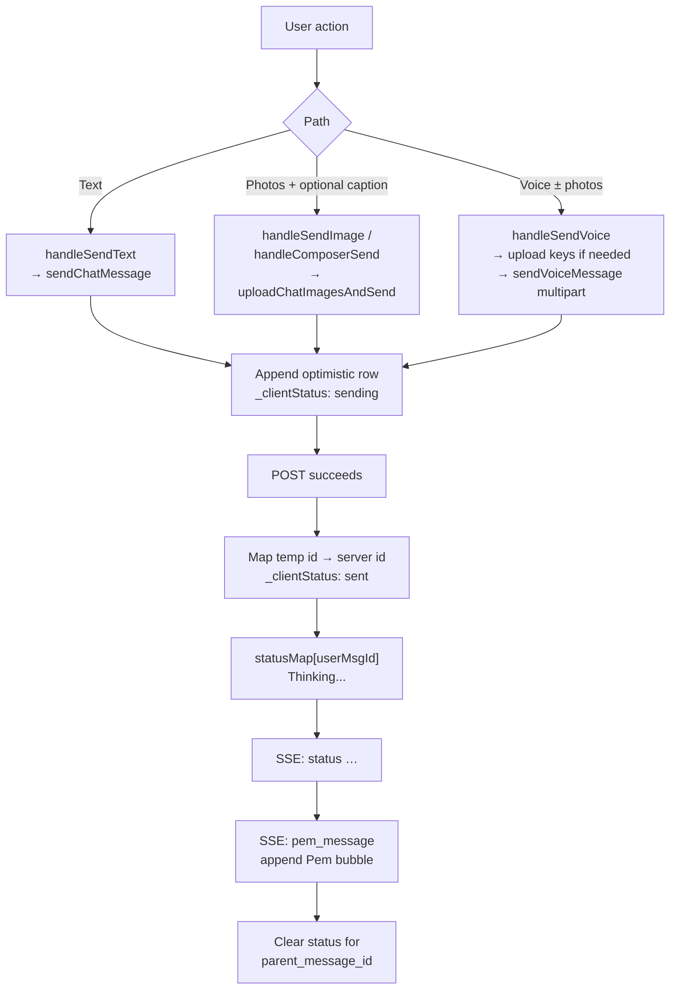
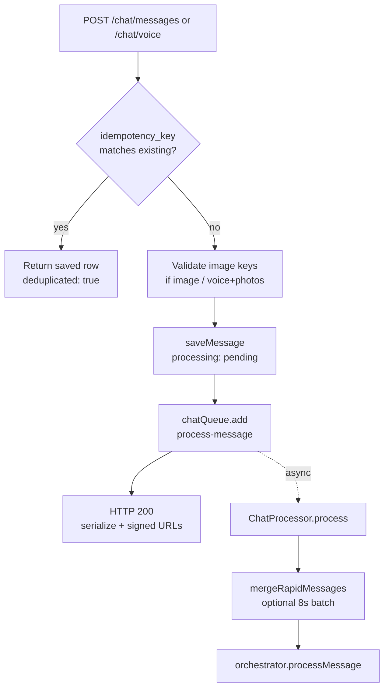
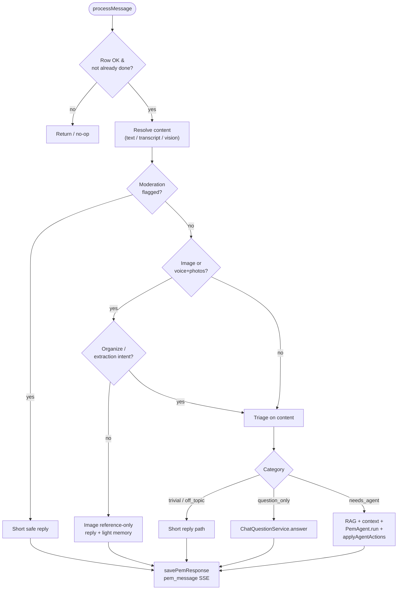
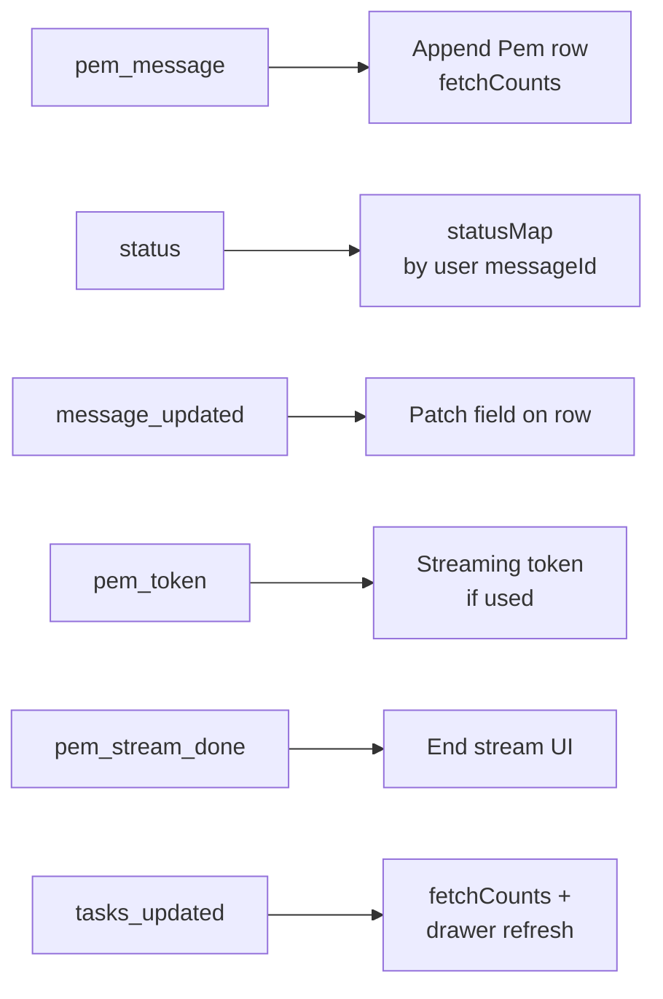
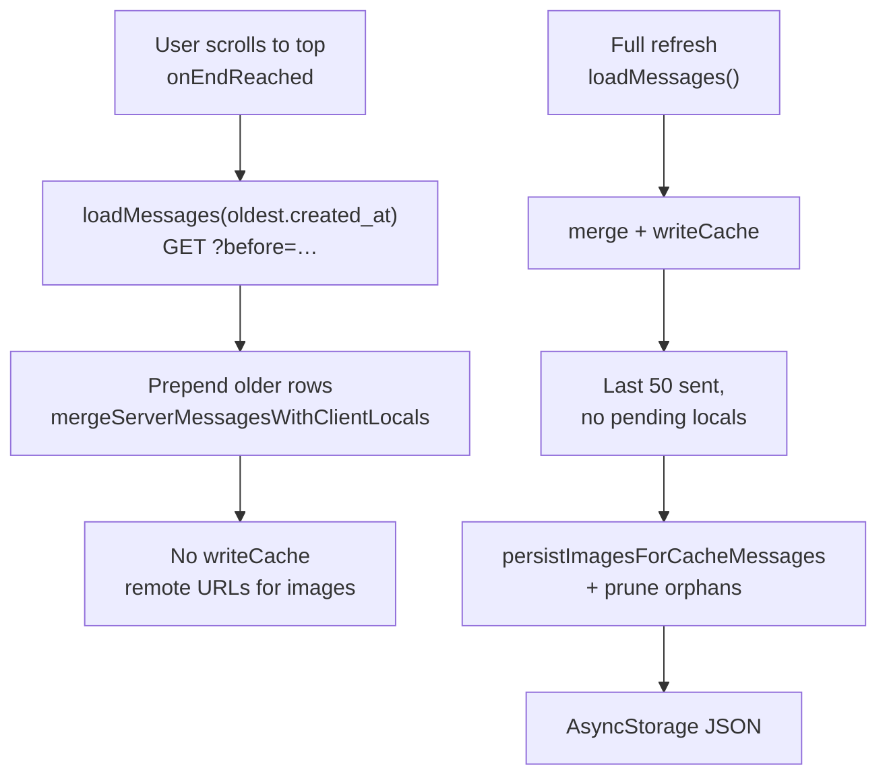
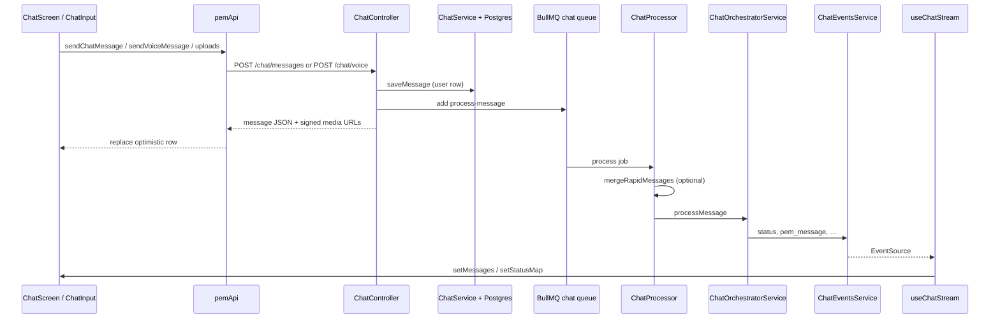

# Chat message pipeline

End-to-end reference for how a user message moves through the mobile app and NestJS backend, and how live replies arrive. Use this when debugging sends, SSE, BullMQ jobs, or offline cache.

**Diagrams:** Mermaid renders in GitHub, many IDEs, and some Markdown previewers. If a diagram does not render, the same information is still spelled out in the tables and sections below.

## Contents

- [Visual overview](#visual-overview) — layered system, lifecycle, sends, backend job, orchestrator routing, SSE types, pagination vs cache
- [Architecture overview (sequence)](#architecture-overview-sequence) — request/response timeline
- [Client: screen, cache, and stream](#client-screen-cache-and-stream)
- [Client send flows](#client-send-flows)
- [Backend: HTTP → DB → queue](#backend-http--db--queue)
- [Backend: orchestration](#backend-orchestration)
- [Debugging cheat sheet](#debugging-cheat-sheet)
- [File index](#file-index)

---

## Visual overview

### End-to-end system (layers)

Who talks to whom at a glance: one **HTTP** path for sends and history, one **long-lived SSE** path for live Pem output, **Postgres** for messages, **R2** for blobs, **Redis** for SSE fan-out (typical Pem setup).

### Chat screen lifecycle (open app → warm state)

Cold start favors perceived speed: **disk cache first**, then **network reconcile**, **SSE** stays up for the session.

### Sending a message (client branches → one HTTP response shape)

All send paths **optimistic UI** first, then **HTTP** replaces the temp row with the real `message.id`, then **SSE** drives status and the Pem bubble.

### Backend: request → durable row → async job

The API returns **immediately** after the user row exists and the job is queued; Pem’s reply is **never** on that same HTTP response.

### Orchestrator routing (high level)

This is a simplified **decision tree** inside `ChatOrchestratorService.processMessage` after `content` is known (including vision path for images). Real code has extra guards (moderation, missing API key, etc.).

### SSE event types (client dispatch)

What `dispatchChatSseEvent` listens for and how the UI uses it:

### History pagination vs offline cache

The list in memory can grow as the user scrolls up; **AsyncStorage + disk images** only track the **tail** (last 50 cacheable sent messages after a full `loadMessages()` without `before`).

---

## Architecture overview (sequence)

Two lanes at runtime:

1. **HTTP** — send message, paginated history (`GET /chat/messages`).
2. **SSE** — `GET /chat/stream` (authenticated) for Pem replies, processing status, and related events.

---

## Client: screen, cache, and stream

### Entry: `app/app/(app)/chat.tsx`

| Concern | Functions / behavior |
|--------|----------------------|
| Initial paint | `readCache()` → AsyncStorage `@pem/chat_messages_v1` → `hydrateCachedImagePaths` (drops missing disk files from persisted paths). |
| Fresh history | `loadMessages()` → `getChatMessages` from `pemApi`. Without `before`: merges with `mergeServerMessagesWithClientLocals` and calls **`writeCache(merged)`**. With `before`: prepends older page only (no cache write). |
| Live updates | `useChatStream({ onPemMessage, onStatus, onMessageUpdated, onTasksUpdated, … })`. |
| Optimistic sends | `handleSendText`, `handleSendImage`, `handleSendVoice`, `handleComposerSend` (text vs pending photos). |

### HTTP helpers: `app/services/api/pemApi.ts`

- `sendChatMessage` → `POST /chat/messages` (JSON: `kind: text | voice | image`, optional `idempotency_key`, image keys, caption).
- `sendVoiceMessage` → `POST /chat/voice` (multipart `audio`, optional `image_keys` JSON).
- `getChatMessages` → `GET /chat/messages?before=&limit=`.
- `requestPhotoUploadUrl` → `POST /chat/photos/upload-url` (presigned PUT for R2).

### Image upload path: `app/services/media/uploadChatImage.ts`

- `uploadPendingChatImageKeys` — presign + `PUT` each local URI.
- `uploadChatImagesAndSend` — uploads then `sendChatMessage({ kind: "image", image_keys, content? })`.

### SSE: `app/hooks/chat/useChatStream.ts` + `app/hooks/chat/chatStream/`

- `openChatStreamConnection` — `EventSource` to `{API}/chat/stream` with `Authorization: Bearer <Clerk JWT>`.
- `dispatchChatSseEvent` — parses JSON by event type: `pem_message`, `status`, `message_updated`, `pem_token`, `pem_stream_done`, `tasks_updated`.

### Offline slice and disk images

- **AsyncStorage**: last **50** “cacheable” sent messages (no optimistic-only fields blocking cache) — see `CACHE_LIMIT` and `writeCache` in `chat.tsx`.
- **Disk**: `app/services/cache/chatCachePersistedImages.ts` — downloads user chat images and Pem photo-recall thumbnails under `documentDirectory/pem-chat-images/v1/`, attaches `_persistedImageUris` / `_persistedPhotoRecall` to cached JSON, **prunes** files not referenced by that slice after each persist pass.

---

## Client send flows

### Text

1. `handleSendText` appends optimistic row (`temp-text-*`, `_clientStatus: "sending"`).
2. `sendChatMessage({ kind: "text", content })`.
3. On success: replace temp id with server `message.id`, `_clientStatus: "sent"`, set `statusMap[message.id] = "Thinking..."`.
4. On failure: `_clientStatus: "failed"`.

### Images (with optional caption)

1. `handleSendImage` / composer with pending photos: optimistic row with `_localUri` / `_pendingLocalUris`.
2. `uploadChatImagesAndSend` → then same replace + status map as text.

### Voice (optional composer photos first)

1. `handleSendVoice` may call `uploadPendingChatImageKeys` then `sendVoiceMessage(audioUri, …, { image_keys })`.
2. Optimistic `temp-voice-*` with `_localUri` for playback until server returns.
3. Same success/failure pattern; on failure, pending composer images can be restored from snapshot.

---

## Backend: HTTP → DB → queue

### Controller: `backend/src/modules/chat/chat.controller.ts`

| Route | What happens |
|-------|----------------|
| `POST /chat/photos/upload-url` | Presigned PUT; key scoped under user (R2). Throttled. |
| `POST /chat/messages` | Optional **idempotency**: `findMessageByIdempotencyKey` → return existing + `deduplicated: true`. **Text**: triage classify → `saveMessage` → enqueue `process-message`. **Image**: validate keys → `saveMessage` → enqueue (triage runs later in orchestrator after vision path). **Voice** (JSON body): same pattern as text if used; primary voice path is multipart route below. |
| `POST /chat/voice` | Transcribe audio → optional R2 upload → `saveMessage` → triage on transcript → update row → enqueue. |
| `GET /chat/messages` | Paginated list; each row serialized + signed media URLs attached. |
| `GET /chat/stream` | SSE subscription for user (see `ChatStreamService`). |

### Persistence: `backend/src/modules/messages/chat.service.ts`

- `saveMessage` — insert user (or Pem) row.
- `getMessages` — cursor `before` on `created_at`, limit clamped (default 50, max 100), chronological page.
- `updateMessage`, `findMessage`, `findMessageByIdempotencyKey`, `serializeMessage`, etc.

### Queue: `backend/src/modules/messaging/jobs/chat.processor.ts`

- Job payload: `{ messageId, userId }`.
- **`mergeRapidMessages`** — within `BATCH_WINDOW_MS` (8s, `constants/chat.constants.ts`), other **pending** user messages from same user may be **merged into this job’s primary** `content`; peers marked `processing_status: 'done'` so their jobs no-op.
- Then **`ChatOrchestratorService.processMessage(messageId, userId, { isFinalAttempt })`**.

---

## Backend: orchestration

### `backend/src/modules/messaging/chat-orchestrator.service.ts` — `processMessage` (conceptual order)

1. Load message; guard user, skip if already `done`.
2. Set `processing`, publish SSE status (`Processing...`).
3. Resolve **content**: plain text/transcript; for **`kind === 'image'`** or **voice + `imageKeys`**, run **`resolveImagePipelineContent`** (vision / caption pipeline).
4. Empty content → short fallback reply via `savePemResponse`.
5. **Moderation** — if flagged, safe reply + embed user line; return.
6. **Image reference-only** branch — if photo message and not “organize into inbox” intent → `imageReferenceOnlyReply` (+ optional lightweight memory); return.
7. **Triage** again on final `content` (with special-case escalation from `question_only` to `needs_agent` for certain habit language).
8. **`trivial`** / **`off_topic`** / **`question_only`** — short paths; `question_only` uses `ChatQuestionService.answer`.
9. **`needs_agent`** — gather context (RAG, calendar, lists, photo recall strip metadata, etc.), `PemAgentService.run`, **`applyAgentActions`**, then **`savePemResponse`** with optional `metadata` (e.g. `photo_recall`).

### `savePemResponse` (same file)

- Inserts **Pem** `messages` row (`parent_message_id` = triggering user message).
- Marks **user** message `processing_status: 'done'`.
- Fire-and-forget Pem message embedding.
- **`chatEvents.publish(userId, 'pem_message', { message })`** — client appends bubble.
- Push: `notifyChatReply` (Expo); the app suppresses banner/sound for `chat_reply` when **Chat is focused and the app is active** (`chatPushPresence` + `AppState`); minimized/closed or another tab open still surfaces the notification.

### `publishStatus`

- `chatEvents.publish(userId, 'status', { messageId, text })` — client shows under **user** message until Pem completes.

### Related modules (by concern)

- Triage: `backend/src/modules/messaging/triage.service.ts`
- Question path: `backend/src/modules/agent/question/chat-question.service.ts`
- Vision / photo intent / recall: `backend/src/modules/media/photo/photo-vision.service.ts`, `photo-attachment-intent.service.ts`, `chat-photo-recall-intent.service.ts`, `backend/src/modules/media/photo/helpers/build-photo-recall-metadata.ts`, `backend/src/modules/media/photo/image-reference-only-reply.service.ts`
- Agent + tool output: `backend/src/modules/agent/pem-agent.service.ts` (delegates to `PemAgentLlmService` in `pem-agent-llm.service.ts`; system strings in `pem-agent.system-prompt.ts`)
- RAG / limits: `backend/src/modules/chat/constants/chat.constants.ts` (`AGENT_RECENT_MESSAGES_LIMIT`, `RAG_*`, `BATCH_WINDOW_MS`, …)

---

## Debugging cheat sheet

| Symptom | Likely cause |
|--------|----------------|
| Bubble stuck on “sending” | Network/auth failure in `sendChatMessage` / `sendVoiceMessage` / upload; check `apiFetch` and Clerk token. |
| “Sent” but no Pem reply | Worker not running, Redis/BullMQ misconfig, job throwing (processor logs), or orchestrator early-return. |
| Status line stuck | SSE disconnected or no final `pem_message`; `statusMap` keyed by **user** message id. |
| Duplicate Pem lines | Rare race; client dedupes `onPemMessage` by `msg.id`. |
| Rapid sends “wrong” merge | `mergeRapidMessages` within 8s window; only `pending` peers. |
| Cold start thumbnails missing | Cache not written yet or files pruned; `readCache` + `loadMessages` order. |
| Old history images remote-only | By design: only tail slice gets `persistImagesForCacheMessages` + AsyncStorage. |

---

## File index

| Area | Path |
|------|------|
| Chat screen + cache + sends | `app/app/(app)/chat.tsx` |
| API client | `app/services/api/pemApi.ts` |
| Image upload | `app/services/media/uploadChatImage.ts` |
| Cached images on disk | `app/services/cache/chatCachePersistedImages.ts` |
| SSE hook + connection | `app/hooks/chat/useChatStream.ts`, `app/hooks/chat/chatStream/openChatStreamConnection.ts`, `app/hooks/chat/chatStream/dispatchChatSseEvent.ts` |
| Chat HTTP + SSE | `backend/src/modules/chat/chat.controller.ts`, `backend/src/modules/messaging/chat-stream.service.ts` |
| DB access | `backend/src/modules/messages/chat.service.ts` |
| Worker | `backend/src/modules/messaging/jobs/chat.processor.ts` |
| Orchestrator | `backend/src/modules/messaging/chat-orchestrator.service.ts` |
| SSE pub/sub | `backend/src/modules/messaging/chat-events.service.ts` (`ChatEventsService`) |

---

## Related product docs

- Photo UX / rollout notes (if present): `docs/photo-support-plan.md`

When behavior or routes change, update **this file** in the same change so launch debugging stays accurate.
